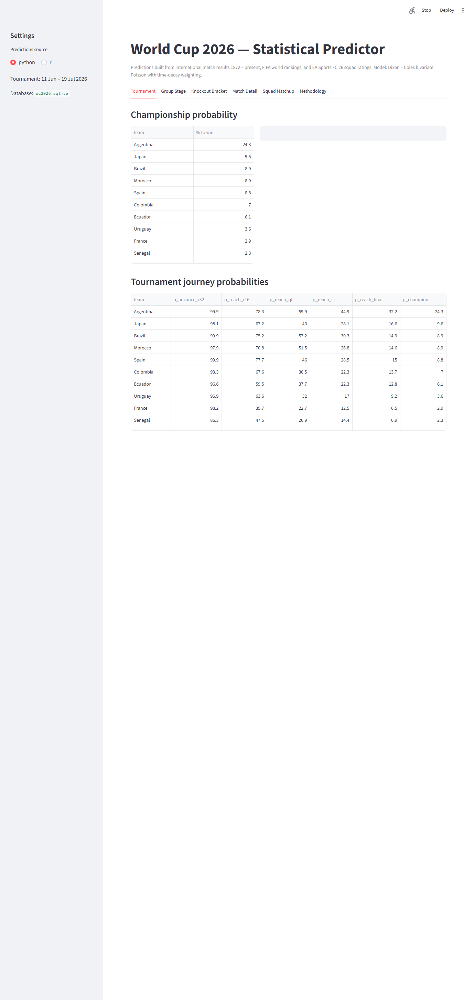
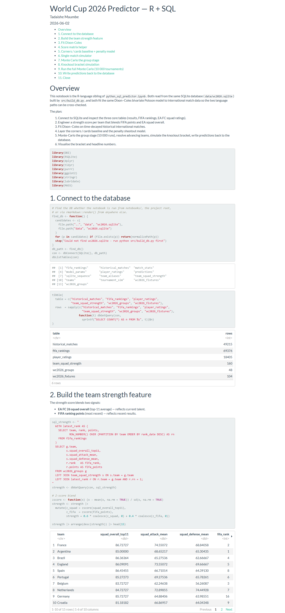

# World Cup 2026 Predictor

**Live dashboard: https://tadananette2026worldcup.streamlit.app/**

Statistical prediction system for the 2026 FIFA World Cup (USA / Canada / Mexico, 11 June – 19 July 2026). Built as two parallel notebooks — **Python + SQL** and **R + SQL** — sharing a single SQLite database so the same data and the same modelling decisions are visible in both ecosystems.

## What it predicts

For every match in the tournament (72 group-stage games + 32 knockout games = 104 matches):

- **Final score** — modal score plus the full probability distribution
- **Corners** — expected count per team
- **Cards** — expected yellow cards per team, red-card probability
- **Group standings** — winner, runner-up, qualifying third-placed teams (top 8)
- **Knockout matchups** — who meets whom in R32, R16, QF, SF, Final
- **Penalty shootouts** — probability each knockout tie goes to penalties, and who wins

## Methodology

| Quantity | Model |
| --- | --- |
| Goals | Dixon–Coles bivariate Poisson, time-decayed historical match weighting |
| Corners | Poisson regression on team attacking style + opponent defensive solidity |
| Yellows | Poisson regression on team discipline + opponent + tournament stage |
| Reds | Logistic regression (rare-event), tournament-stage uplift |
| Penalties | P(tie level after 120') from goal model × historical shootout conversion |
| Bracket | Monte Carlo, 10 000 tournament simulations |

A realistic ceiling for exact-score accuracy is ~12–15%. The predictions are evaluated by **Brier score** and **log-loss** (calibrated probabilities), not raw hit rate — that's how you actually compare to bookmakers.

## Headline result (10 000-simulation championship odds)

Predictions after layering the EA Sports FC 26 position-level squad matchup
on top of the Dixon – Coles fit.

| # | Team | Champion | Reaches Final | Reaches SF |
| --- | --- | ---: | ---: | ---: |
| 1 | Argentina | 24.3 % | 32.2 % | 44.9 % |
| 2 | Japan | 9.6 % | 16.6 % | 28.1 % |
| 3 | Brazil | 8.9 % | 14.9 % | 30.3 % |
| 4 | Morocco | 8.9 % | 14.6 % | 26.8 % |
| 5 | Spain | 8.8 % | 15.0 % | 28.5 % |
| 6 | Colombia | 7.0 % | 13.7 % | 22.3 % |
| 7 | Ecuador | 6.1 % | 12.8 % | 22.3 % |
| 8 | Uruguay | 3.6 % | 9.2 % | 17.0 % |
| 9 | France | 2.9 % | 6.5 % | 12.5 % |
| 10 | Senegal | 2.3 % | 6.9 % | 14.4 % |



The R sibling notebook produces a parallel set of numbers from the same
SQLite database — used for cross-language validation.



## Repo layout

```
worldcup-2026-predictor/
├── data/
│   ├── raw/              # downloaded datasets
│   ├── processed/        # cleaned tables
│   ├── fixtures/         # 2026 groups + match schedule
│   └── wc2026.sqlite     # the shared database
├── notebooks/
│   ├── python_sql_predictor.ipynb
│   └── r_sql_predictor.Rmd
├── src/
│   ├── schema.sql        # SQLite tables
│   ├── build_db.py       # ETL: CSVs → SQLite
│   ├── models.py         # Dixon-Coles + simulation core
│   ├── run_predictions.py# headless full pipeline
│   ├── smoke_test.py     # synthetic-data sanity check
│   └── inspect_db.py     # quick data-quality peek
├── models/               # pickled fitted models
├── app/                  # Streamlit dashboard
└── reports/              # exported prediction tables, charts
```

## Quickstart

```bash
pip install -r requirements.txt
python src/build_db.py              # builds data/wc2026.sqlite
python -m src.smoke_test            # sanity-check the modelling code
python -m src.run_predictions       # headless full pipeline (alt. to notebook)
jupyter notebook notebooks/python_sql_predictor.ipynb
# or in R:
# rmarkdown::render("notebooks/r_sql_predictor.Rmd")
streamlit run app/dashboard.py      # interactive dashboard
```

### Kaggle credentials

`build_db.py` downloads three datasets via `kagglehub`, which needs Kaggle
credentials. Either:

- Drop your `kaggle.json` at `~/.kaggle/kaggle.json` (Windows: `%USERPROFILE%\.kaggle\kaggle.json`), or
- Set the environment variables `KAGGLE_USERNAME` and `KAGGLE_KEY`, or
- Download the three CSVs manually from Kaggle and place them in `data/raw/` — the script will pick them up and skip the network step.

## Data sources

| Source | Used for | Kaggle slug |
| --- | --- | --- |
| International football results, 1872 – present | Goal model, outcome model, historical priors | `martj42/international-football-results-from-1872-to-2017` |
| FIFA world rankings | Strength feature, fallback when EA data is missing for a nation | `cashncarry/fifaworldranking` |
| EA Sports FC 26 player ratings | Squad-strength score (top-23 overall, top-11 starting XI, attack/defence sub-ratings) — captures current-form talent better than FIFA rank | `rovnez/fc-26-fifa-26-player-data` (FC 25 fallback: `nyagami/ea-sports-fc-25-database-ratings-and-stats`) |
| 2026 fixtures and group draw | Tournament structure | FIFA, drawn 5 December 2025 |

Corners and cards are not present in any of these sources. They are modelled from historical World Cup / Euro / Copa América per-match averages (publicly published), scaled by team-strength differential — a baseline, not a high-precision predictor.

## Grading the model during the tournament

The dashboard has a **Results & Accuracy** tab that grades predictions
against actual results as matches finish. Refresh the results table with:

```bash
python src/fetch_results.py
```

The script pulls from [football-data.org](https://www.football-data.org/)
(free tier; set `FOOTBALL_DATA_TOKEN` for a higher rate limit) and merges
anything in `data/manual_results.json` so a missing or delayed feed
doesn't block evaluation. Re-run any time — it's idempotent. Metrics
reported:

- **Outcome accuracy** — share of matches where the model's top pick
  (home / draw / away) was the actual result
- **Brier score** — averaged across the three outcomes; lower is better,
  a flat 1/3 guess scores ~0.667
- **Goals RMSE** — modal score vs actual, per side
- **Calibration table** — predicted-probability bands vs realised hit rate

Final report card lands after 19 July 2026.

## Status

Active build, started May 2026 — predictions locked before the opening match in Mexico City on 11 June 2026.
